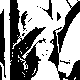
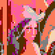
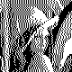
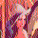
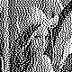
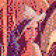
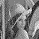

誤差拡散メソッド
================

wakuflowプログラムでは色数を減らす変換を行う際にどのような方式で誤差拡散（ディザリング）を行うか指定できます。

現在のところ、対応しているのは次の通りです。

* `none` : 特にディザリングは行いません
* `floyd` : Floyd-Steinberg
* `sierra3` : Sierra (3 line)
* `sierra2` : Sierra (2 line)
* `sierra-lite` : Sierra Lite
* `atkinson` : Atkinson

変換サンプル
------------

| 指定          | サンプル                              |                                           |                                           |                                           |
|---------------|:-------------------------------------:|:-----------------------------------------:|:-----------------------------------------:|:-----------------------------------------:|
| (入力画像)    |            |                |                |                |
| `none`        |         |         |         |         |
| `floyd`       |        |        |        |        |
| `sierra3`     |      |      |      |      |
| `sierra2`     |      |      |      |      |
| `sierra-lite` |  |  |  |  |
| `atkinson`    |     |     |     |     |
